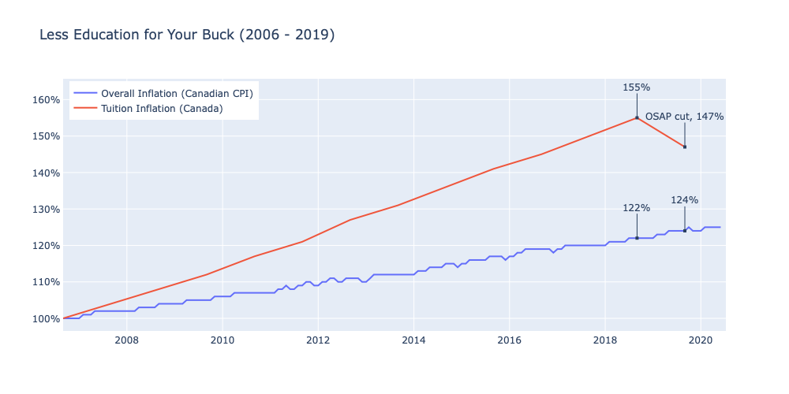

# Less-Education-For-Your-Buck
Comparison of inflation (CPI) vs the cost of university tuition in Canada

## :mag: Methodology
Data retrieved from the Statscan website for the Canadian Consumer Price Index and Tuition Costs in Canada. The data was then processed in Excel and cleaned in Jupyter Notebooks using Pandas. Once cleaning was complete, the data was visualized using plotly. 

`See Jupyter Notebook for more information.`

## :chart_with_upwards_trend: Results Discussion
Is University worth the cost?

With classes moved entirely online, costs of university increasing, and financial aid in Ontario being cut, the choice to attend higher education is facing increased scrutiny.

Inspired by a visualization for US college costs relative to inflation, I plotted inflation (Canadian consumer price index) relative to average tuition costs in Canada. 

The results weren’t quite as shocking as those in the US, due in part to a smaller time frame, but still proved to be eye-opening nonetheless. 

Costs of tuition are up 47% since 2006 relative to a 24% increase in the Canadian CPI. Prior to the OSAP cuts announced in 2019, tuition peaked at a 55% increase relative to 22% inflation.

Despite increasing costs and current economic circumstances, Universities are not offering discounts for zoom courses, student tenants continue to foot the bill for rent, and international students are left with a large degree of uncertainty. 

It will be interesting to see if potential students choose to take a gap year or opt for alternate educational offerings given the current situation. 

## :floppy_disk: Data

| Data File           | Source   | Update Frequency  | Date Range          |
| -------------       | ---------| ----------------- | -----------         |
| [CPI / Inflation](https://www150.statcan.gc.ca/t1/tbl1/en/tv.action?pid=1810025601&cubeTimeFrame.startMonth=01&cubeTimeFrame.startYear=2005&cubeTimeFrame.endMonth=06&cubeTimeFrame.endYear=2020&referencePeriods=20050101%2C20200601)| Statscan | Monthly           | Jan 1949 - Jun 2020 |
| [Tuition](https://www150.statcan.gc.ca/t1/tbl1/en/tv.action?pid=3710000301&pickMembers%5B0%5D=1.1&cubeTimeFrame.startYear=2006+%2F+2007&cubeTimeFrame.endYear=2019+%2F+2020&referencePeriods=20060101%2C20190101)| Statscan | Annual            | 2006 - 2019         |

## :books: Resources 
* Python Packages: Pandas, Plotly

## :bulb: Learnings
* Data cleaning and preparation
* Visualization for time series
* Flexibility / incorporating user feedback

## :wave: Author
Alex Kruczkowski
